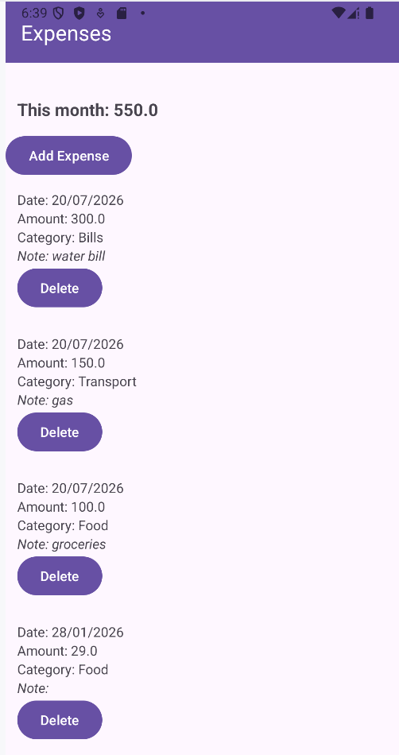
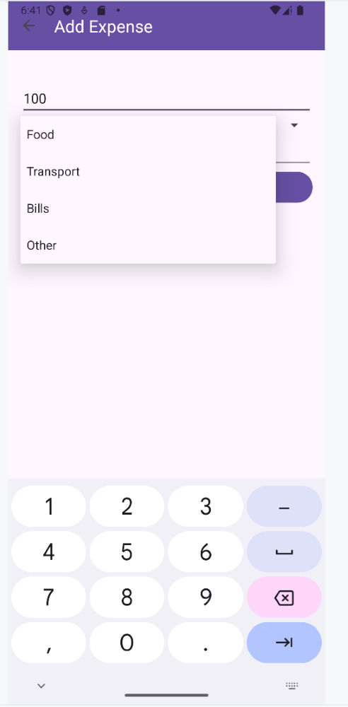

# Expense Tracker (Android)

An Android application developed in Java that helps users record and manage their daily expenses. 
The app stores all data locally using Room Database and provides an intuitive interface for adding, viewing, categorizing, and deleting expenses.

## Features

- Add new expenses
- Categorize expenses (Food, Transport, Shopping, Bills, etc.)
- View all recorded expenses
- Delete expenses
- Automatically display the current month's total spending
- Navigation between screens using the Android Navigation Component
- Automatic UI updates using LiveData
- Efficient expense list using RecyclerView

## Technologies Used

- Java
- XML
- Android Studio
- Room Database
- DAO (Data Access Object)
- LiveData
- RecyclerView
- Navigation Component
- Fragments
- SQLite (through Room)

## Project Structure

- **Expense.java** – Room Entity representing an expense.
- **ExpenseDao.java** – Database queries (insert, delete, retrieve, calculate totals).
- **AppDatabase.java** – Room database configuration.
- **ExpensesFragment.java** – Displays the list of expenses and monthly total.
- **AddExpenseFragment.java** – Allows users to create a new expense.
- **ExpenseAdapter.java** – RecyclerView adapter for displaying expenses.
- **MainActivity.java** – Hosts the Navigation Component and app toolbar.

## Database

Each expense contains:

- Amount
- Category
- Date
- Note

Room Database is used for local persistent storage, while LiveData automatically refreshes the RecyclerView whenever the database changes.

## Screens

- Expense List
- Add Expense

 # Screenshots

| Expense List | Add Expense |
|--------------|-------------|
|  |  |

## Future Improvements

- Edit existing expenses
- Expense history by month
- Charts and spending analytics
- Search and filtering
- Export data

## Learning Objectives

This project was developed to practice Android application development concepts, including:

- Local database management with Room
- CRUD operations
- RecyclerView implementation
- Fragment-based navigation
- LiveData observation
- Android UI design using XML
